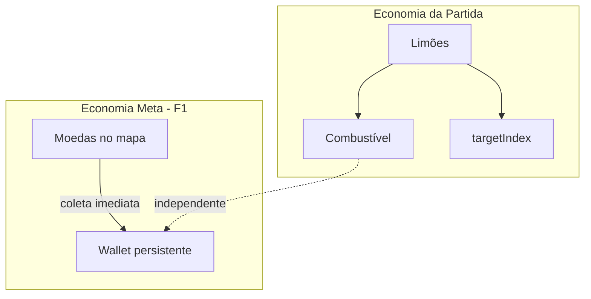

# SPEC: Sistema de Moedas — Fase 1

**Projeto:** Rocket Lemon  
**Data:** 2026-07-03  
**Status:** Aprovado para implementação futura  
**Escopo:** F1 — coleta, persistência, HUD e debug API (sem loja)

---

## 1. Resumo

Esta especificação define o **sistema de moedas meta** para Rocket Lemon: moedas opcionais espalhadas durante a viagem da nave até a Lua, coletáveis em voo e persistidas imediatamente no dispositivo do jogador via `localStorage`.

A Fase 1 entrega a **economia base** (wallet + spawn + coleta + feedback visual). A loja de cosméticos (skins, trilhas, acessórios) fica documentada como roadmap F2+, sem implementação nesta fase.

**Objetivo de produto:** dar recompensa tangível por exploração e habilidade durante a subida, criando base para compras futuras dentro do jogo.

**Arquivo principal afetado na implementação:** [`index.html`](../../../index.html) (jogo monolítico HTML + CSS + JS).

---

## 2. Decisões de produto

| Decisão | Escolha | Justificativa |
|---------|---------|---------------|
| Depósito na conta | **Imediato ao coletar** | Moeda vai direto ao wallet persistente, mesmo se o jogador morrer depois. Reduz frustração e reforça feedback positivo. |
| Escopo desta SPEC | **F1 apenas** | Spawn, coleta, persistência, HUD, telas de fim, debug API. Sem loja. |
| Backend | **Não** | `localStorage` no browser; alinhado ao projeto vanilla sem build. |
| Relação com limões | **Economias separadas** | Limões = missão + combustível (run). Moedas = meta-progressão (persistente). |
| Anti-cheat | **Não na F1** | Save editável via DevTools é aceitável para jogo interno. |

---

## 3. Arquitetura

### 3.1 Duas economias

O jogo passa a operar com duas camadas econômicas independentes:



- **Limões** não mudam: continuam obrigatórios para progressão e reabastecimento.
- **Moedas** são opcionais, flutuam no ar entre plataformas e não bloqueiam avanço.
- Coleta imediata significa que não há contador temporário de run — o HUD mostra sempre o saldo persistente.

### 3.2 Fluxo de dados

```mermaid
sequenceDiagram
  participant Boot
  participant LS as localStorage
  participant GW as generateWorld
  participant Loop as updatePlaying
  participant Wallet

  Boot->>LS: loadSave()
  LS-->>Boot: wallet ou default
  GW->>GW: generateCoins()
  Loop->>Loop: check coin proximity
  Loop->>Wallet: collectCoin(coin)
  Wallet->>Wallet: coins += value
  Wallet->>LS: saveWallet()
  Loop->>Loop: toast + particles
```

### 3.3 Módulo de economia (organização no código)

Nova seção `// --- economy ---` em `index.html` com funções isoladas:

| Função | Responsabilidade |
|--------|------------------|
| `loadSave()` | Carrega wallet do `localStorage` ou retorna default |
| `saveWallet()` | Persiste wallet após mutação |
| `generateCoins(boundaries, obstacles)` | Popula `coins[]` durante geração do mundo |
| `collectCoin(coin)` | Lógica de coleta: wallet, save, toast, partículas, SFX |
| `updateCoinCollisions()` | Verifica proximidade foguete ↔ moedas não coletadas |
| `drawCoins()` | Renderiza moedas no mundo |
| `drawCoinBalance(x, y)` | Desenha ícone + saldo (reutilizado em HUD, title, overlays) |

---

## 4. Modelo de dados

### 4.1 Save persistente (localStorage)

**Chave:** `rocket_lemon_save_v1`

**Schema v1:**

```javascript
{
  version: 1,
  coins: 0,        // saldo atual (pode decrementar na F2 ao comprar)
  totalEarned: 0   // estatística acumulada; nunca decrementa
}
```

**Regras:**

- Carregar no boot, antes do game loop.
- Se JSON ausente, inválido ou `version` incompatível: iniciar com default zerado (sem crash).
- Escrita síncrona após cada coleta (volume baixo — aceitável).
- Campo `version` reservado para migração futura (F2 adicionará `inventory`, `equipped`).

### 4.2 Moeda no mapa (temporária por run)

```javascript
{
  x: number,           // posição horizontal (world space)
  y: number,           // posição vertical (world space)
  value: 1 | 3,        // valor ao coletar
  collected: false,
  bobPhase: number     // fase aleatória para animação de bob
}
```

Array global: `coins[]` — resetado a cada `generateWorld()` via `startGame()`.

### 4.3 Constantes de configuração

Adicionar em `CONFIG`:

```javascript
coinCollectRadius: 31,      // CONFIG.rocketRadius (13) + 18
coinMinPadDist: 50,         // distância mínima a qualquer plataforma
coinObstacleBonusDist: 70,  // distância a obstáculo para value: 3
coinSpawnRetries: 5         // tentativas máximas por posição inválida
```

---

## 5. Regras de gameplay

### 5.1 Spawn de moedas

Geradas em `generateWorld()` **após** plataformas e obstáculos, usando os mesmos `boundaries` dos segmentos verticais.

**Quantidade por segmento (entre dois boundaries consecutivos):**

| Dificuldade | Moedas por segmento | Total aproximado por run |
|-------------|---------------------|--------------------------|
| easy        | 0–1                 | ~3                       |
| medium      | 0–2                 | ~8–12                    |
| hard        | 1–2                 | ~12–18                   |

**Posicionamento:**

- **Y:** entre `boundaries[s] + 100` e `boundaries[s + 1] - 100`
- **X:** `30 + Math.random() * (W - 60)` — mesma margem lateral dos obstáculos

**Validação de posição (até 5 tentativas por moeda):**

- Distância mínima de **50px** a qualquer plataforma (centro ou bordas do pad).
- Se após 5 tentativas não houver posição válida, descartar aquela moeda (não bloquear geração do mundo).

**Valor da moeda:**

- `value: 1` — posição padrão.
- `value: 3` — se distância euclidiana a **qualquer obstáculo no mesmo segmento** `< 70px` (risco/recompensa).

**Fase balística (entre planeta e Lua):**

- Spawnar **1–2 moedas extras** na faixa vertical entre o planeta (`platforms[platforms.length - 1].y`) e a Lua (`moon.y`).
- Todas com `value: 3` (alta dificuldade de coleta no voo balístico).

### 5.2 Coleta

**Detecção:** proximidade circular, espelhando a lógica de limão (~L930–936 em `index.html`):

```javascript
const dx = rocket.x - coin.x;
const dy = rocket.y - coin.y;
const reach = CONFIG.coinCollectRadius;
if (dx * dx + dy * dy < reach * reach) collectCoin(coin);
```

**Sequência ao coletar (`collectCoin`):**

1. Marcar `coin.collected = true`
2. `wallet.coins += coin.value`
3. `wallet.totalEarned += coin.value`
4. Chamar `saveWallet()`
5. Toast: `+1 MOEDA` ou `+3 MOEDAS` (plural quando N > 1)
6. SFX: reutilizar `audio.sfxPickup()` na F1
7. Partículas douradas (`#ffd166`, `#ffffff`) — distintas do verde do limão

**Onde verificar colisão:**

- `updatePlaying()` — após movimento do foguete, antes ou depois de colisões com plataformas (ordem não crítica).
- Durante voo balístico (`ballistic === true`) — moedas entre planeta e Lua também são coletáveis.

### 5.3 Reset de run

- `startGame()` → `generateWorld()` → novo `coins[]` com todas `collected: false`.
- Wallet **não** reseta entre runs, retries (`R`) ou reload da página.

### 5.4 O que NÃO muda

- Mecânica de limões, combustível, pouso, obstáculos, estilingue e vitória permanecem intactos.
- Personagens e bônus de gameplay não são afetados na F1.

---

## 6. UI/UX

### 6.1 HUD (durante voo)

**Visível em:** `playing`, `slingshot`, voo `ballistic`.

**Posição:** canto superior esquerdo, abaixo da barra de combustível (~x: 20, y: 88).

**Formato:** sprite de moeda (10×10px escalado) + número do saldo (`156`).

**Comportamento:** atualiza imediatamente ao coletar (reflete wallet persistente, não delta da run).

**Conflito com HUD estendido (Weslley):** se `extendedHud` estiver ativo, deslocar linha de moedas para y: 90 ou integrar na segunda linha do HUD sem sobrepor indicadores VX/VY/ÂNG.

### 6.2 Tela de título

Saldo discreto no canto inferior ou superior: `MOEDAS: N`.

Visível em `state === 'title'` para o jogador ver progresso acumulado entre partidas.

### 6.3 Telas de fim

**Vitória** (overlay após `winTime > 3.2`):

- Linha adicional: `MOEDAS: N` (saldo total atual).
- Mensagem implícita: moedas coletadas na run já estão salvas.

**Derrota** (overlay `lose`):

- Mesma linha `MOEDAS: N`.
- Reforça que moedas coletadas antes da explosão foram preservadas (depósito imediato).

### 6.4 Distinção visual limão vs moeda

| Elemento | Limão | Moeda |
|----------|-------|-------|
| Cor principal | Verde (`#6abf4b`) | Dourado (`#ffd166`) |
| Posição | Sobre plataforma (pad) | Flutuando no ar |
| Obrigatoriedade | Sim (progressão) | Não (opcional) |
| Efeito | +combustível | +wallet |
| Glow | Verde | Dourado |

---

## 7. Integração técnica

Pontos de alteração em [`index.html`](../../../index.html):

| Local (aprox.) | Mudança |
|----------------|---------|
| Boot (~L2205) | `loadSave()` antes do game loop |
| `CONFIG` (~L35) | `coinCollectRadius`, `coinMinPadDist`, `coinObstacleBonusDist`, `coinSpawnRetries` |
| `SPRITES` (~L143) | Entry `coin` via `makeSprite()` |
| Variáveis globais (~L566) | `let coins = []`, `let wallet = null` |
| `generateWorld()` (~L617) | Chamar `generateCoins(boundaries, obstacles)` ao final |
| `updatePlaying()` (~L867) | Chamar `updateCoinCollisions()` após movimento do foguete |
| `startGame()` (~L673) | Wallet intacto; moedas regeneradas via `generateWorld()` |
| Render world (~L1920) | `drawCoins()` junto a `drawLemons()` |
| `drawHUD()` (~L1540) | Saldo de moedas |
| `renderTitle()` | Saldo no menu |
| Win overlay (~L1951) | Linha `MOEDAS: N` |
| Lose overlay (~L1964) | Linha `MOEDAS: N` |
| `window.__rl` (~L2208) | Getters e helpers de debug (ver seção 9) |

---

## 8. Arte e áudio

### 8.1 Sprite de moeda

Novo entry `SPRITES.coin` via `makeSprite()`:

- Pixel art dourado, ~10×10px.
- Paleta sugerida: `#ffd166` (corpo), `#ffffff` (brilho), `#c9a020` (sombra).

### 8.2 Animação

- Bob vertical: `Math.sin(time * 3 + coin.bobPhase) * 3`
- Glow: `shadowColor: '#ffd166'`, `shadowBlur: 12`
- Rotação opcional (baixa prioridade na F1).

### 8.3 Culling

Não desenhar moedas fora da viewport (mesmo padrão de `drawLemons()` — verificar `sy(coin.y)` contra `-30` e `H + 30`).

### 8.4 Áudio

- **F1:** reutilizar `audio.sfxPickup()` existente.
- **F2 (futuro):** SFX dedicado de moeda (tom mais agudo/brilhante que limão).

---

## 9. API de debug

Estender `window.__rl` com:

```javascript
get wallet() { return wallet; },
get coins() { return coins; },
resetWallet() {
  wallet = { version: 1, coins: 0, totalEarned: 0 };
  saveWallet();
},
addCoins(n) {
  wallet.coins += n;
  wallet.totalEarned += n;
  saveWallet();
},
```

Uso esperado no console:

```javascript
__rl.wallet           // { version: 1, coins: 42, totalEarned: 42 }
__rl.coins            // array de moedas do mapa atual
__rl.addCoins(10)     // incrementa saldo (dev)
__rl.resetWallet()    // zera save (dev)
```

---

## 10. Requisitos não-funcionais

| Requisito | Critério |
|-----------|----------|
| Performance | Spawn O(segments × retries); colisão O(coins) por frame (~15 moedas max) — negligível |
| Compatibilidade | Chrome, Firefox, Safari (mesmo suporte atual do jogo) |
| Privacidade | Dados locais apenas; sem PII; sem rede |
| Manutenibilidade | Seção `// --- economy ---` isolada; funções com responsabilidade única |
| Robustez | Save corrupto → fallback silencioso para wallet zerado |
| Mobile | Hitbox generosa (`coinCollectRadius: 31`); moedas visíveis com glow |

---

## 11. Testes manuais

Checklist para validação após implementação:

- [ ] **T1** — Partida nova em easy: moedas aparecem flutuando entre pads
- [ ] **T2** — Coletar moeda: toast, partículas douradas, HUD atualiza
- [ ] **T3** — Recarregar página após coleta: saldo mantido no title e HUD
- [ ] **T4** — Coletar moeda e morrer: saldo permanece inalterado
- [ ] **T5** — Retry (`R`): moedas do mapa respawnam; wallet mantém total acumulado
- [ ] **T6** — Moeda perto de obstáculo: toast `+3 MOEDAS`
- [ ] **T7** — `localStorage` corrompido (valor `"invalid"`): jogo inicia sem crash, wallet zerado
- [ ] **T8** — `__rl.wallet`, `__rl.addCoins(10)`, `__rl.resetWallet()` funcionam no console
- [ ] **T9** — Moedas na fase balística (entre planeta e Lua) são coletáveis
- [ ] **T10** — Limões continuam funcionando independentemente (sem regressão)

---

## 12. Riscos e mitigações

| Risco | Impacto | Mitigação |
|-------|---------|-----------|
| Confusão limão vs moeda | Jogador não entende diferença | Visual dourado vs verde; moedas no ar, limões nos pads |
| Save editável via DevTools | Inflação artificial de moedas | Aceitável para jogo interno; documentado |
| `index.html` grande (~2238 linhas) | Dificuldade de manutenção | Seção economy isolada; extrair módulo só se F2 exigir |
| Moeda em posição impossível | Frustração ou overlap visual | Validação de distância + max 5 retries; descartar se inválido |
| HUD overcrowded (Weslley) | Sobreposição de texto | Posicionar moedas abaixo ou adaptar layout extendedHud |

---

## 13. Roadmap F2+ (fora de escopo)

Itens planejados para fases futuras, **não implementados na F1**:

| Fase | Entregável |
|------|------------|
| **F2 — Loja básica** | Novo estado `shop` no menu; catálogo `SHOP` com 3–4 skins de nave; comprar e equipar |
| **F3 — Cosméticos** | Trilhas de partículas alternativas; acessórios desenhados no foguete (antena, bandeira) |
| **F4 — Economia avançada** | Bônus de vitória; multiplicador por dificuldade; preços balanceados |
| **F5 — Meta** | Conquistas ("100 moedas em uma run"); estatísticas no save |

**Save schema v2 (preview):**

```javascript
{
  version: 2,
  coins: 0,
  totalEarned: 0,
  inventory: {
    rocketSkins: ['default'],
    trails: ['default'],
    accessories: []
  },
  equipped: {
    rocketSkin: 'default',
    trail: 'default',
    accessory: null
  }
}
```

A F1 usa schema v1 minimalista para não bloquear evolução.

---

## 14. Glossário

| Termo | Definição |
|-------|-----------|
| **Wallet** | Objeto persistente com saldo de moedas do jogador |
| **Run / partida** | Uma tentativa de ir da Terra à Lua; resetada em `startGame()` |
| **Meta-moeda** | Moeda que persiste entre partidas (diferente de combustível/limão) |
| **Segmento** | Faixa vertical entre dois `boundaries` consecutivos no mapa |
| **Moeda valiosa** | Moeda com `value: 3`, spawnada perto de obstáculos |
| **Depósito imediato** | Crédito no wallet no momento da coleta, não ao fim da partida |

---

## 15. Referências

- Código atual: [`index.html`](../../../index.html)
- README do jogo: [`README.md`](../../../README.md)
- Função de referência para coleta: `collectLemon()` (~L785)
- Função de referência para geração: `generateWorld()` (~L617)
- Debug API existente: `window.__rl` (~L2208)
